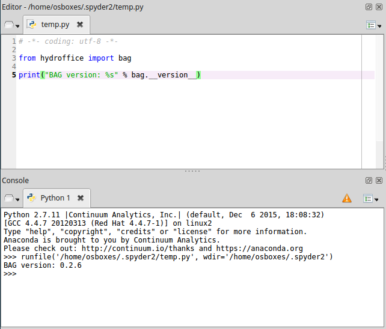

How to install
==============

General approach
----------------

* the simplest way: ``pip install hyo2.bag``

* for the latest features: ``git clone ssh://git@github.com:hydroffice/hyo2_bag.git``

On Linux Mint
-------------

This document describes a tested configuration to install the BAG library on Linux Mint.

For use with a VM image:

* Download from here: http://www.osboxes.org/linux-mint/#linuxmint-173-rosa-vmware
* Change Display resolution *[optional]*
* Install VM Tools using Software Manager (select open-vm-tools-desktop) *[optional]*

Installation:

* Download 64-bit Python 3.6 miniconda: http://conda.pydata.org/miniconda.html
* Install it from terminal: ``bash Miniconda-latest-Linux-x86_64.sh``
* Install dependencies using conda (since with pip they may fail): ``conda install numpy matplotlib gdal lxml spyder``
* Finally use pip for hyo2.bag: ``pip install hyo2.bag``

Test:

* Open Spyder using the terminal: ``spyder``
* Write in the temp.py:

.. code-block:: python

   from hydroffice import bag
   print("BAG version: %s" % bag.__version__)

* Run the script and you should get the library version without errors:

.. NOTE::
   If you get issues on the installation, you may open a ticket:

   * https://github.com/hydroffice/hyo2_bag/issues
